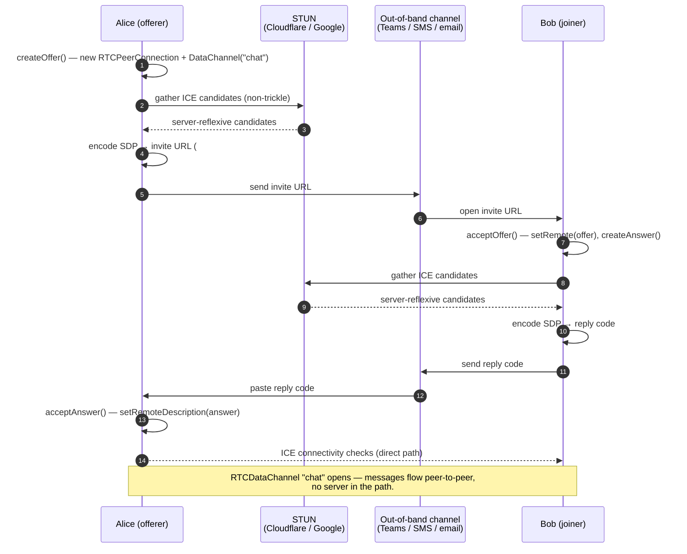

# spike-p2p-chat

A two-person, serverless chat PWA. Browsers connect directly over WebRTC; an
invite URL and a short reply code are exchanged out-of-band (Teams, SMS, email)
to bootstrap the connection. Once the data channel opens, no server sees the
chat.

## Develop

```bash
npm install
npm run dev          # vite dev server
npm run dev:host     # use this when running inside the devcontainer so the host machine can reach the server
npm test             # vitest (one-shot); npm run test:watch for watch mode
npm run ci           # format:check + typecheck + lint + test + build
```

Other scripts: `npm run build`, `npm run preview`, `npm run lint`,
`npm run format`, `npm run typecheck`.

## How it works

Signaling is **manual and asymmetric**: Alice's offer is encoded into a
clickable invite URL (the joiner's tab isn't open yet, so it needs a link);
Bob's answer is just an encoded string (the offerer's tab is already open, so
paste is enough). Both SDPs are LZ-string compressed and base64url-encoded so
they fit in a URL fragment. Fragments never leave the browser, so the static
host serving the bundle never sees the SDP — and once the data channel opens,
the chat traffic flows directly peer-to-peer.



Source map:

- `src/core/rtc.ts` — WebRTC offer/answer wrapper, non-trickle ICE gathering.
- `src/core/encoding.ts` — LZ-string + base64url SDP packing.
- `src/core/url.ts` — invite-URL construction and hash parsing.
- `src/hooks/useChatSession.ts` — connection state machine; owns the live
  `RTCPeerConnection`.
- `src/screens/Offerer.tsx` / `src/screens/Joiner.tsx` — the two signaling UIs.
- `src/components/Chat.tsx` — the connected-state chat transcript and composer.
