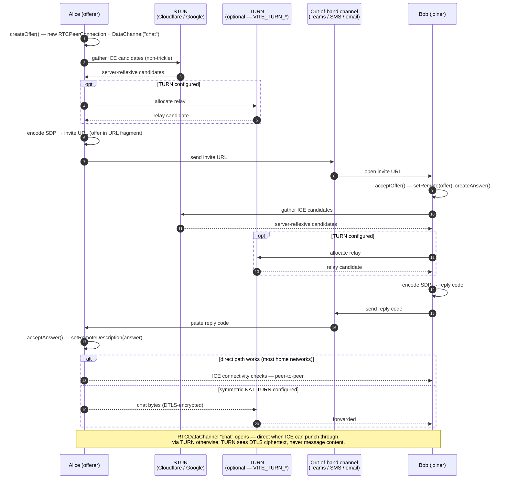

# spike-p2p-chat

A two-person, serverless chat PWA. Browsers connect directly over WebRTC; an
invite URL and a short reply code are exchanged out-of-band (Teams, SMS, email)
to bootstrap the connection. Once the data channel opens, no server sees the
chat.

## Develop

First-time setup (devcontainer users): run `./scripts/setup-devcontainer.sh` to
generate `.devcontainer/.env` with your git name/email (defaults are taken from
your host `git config`). The values are loaded into the container on start and
applied via `git config --global`, so commits inside the container are
attributed to you. The file is gitignored.

```bash
npm install
npm run dev          # vite dev server
npm run dev:host     # use this when running inside the devcontainer so the host machine can reach the server
npm test             # vitest (one-shot); npm run test:watch for watch mode
npm run ci           # format:check + typecheck + lint + test + build
```

## How it works

Signaling is **manual and asymmetric**: Alice's offer is encoded into a
clickable invite URL (the joiner's tab isn't open yet, so it needs a link);
Bob's answer is just an encoded string (the offerer's tab is already open, so
paste is enough). Both SDPs are LZ-string compressed and base64url-encoded so
they fit in a URL fragment. Fragments never leave the browser, so the static
host serving the bundle never sees the SDP — and once the data channel opens,
the chat traffic flows directly peer-to-peer (or via an optional TURN relay on
networks where direct ICE can't punch through; the relay sees DTLS ciphertext,
never message content — see `docs/known_limitations.md`).



Source map:

- `src/core/rtc.ts` — WebRTC offer/answer wrapper, non-trickle ICE gathering;
  optional TURN relay appended to `ICE_CONFIG` when the `VITE_TURN_*` env vars
  are set.
- `src/core/rtcDiagnostics.ts` — dev-only ICE/connection-state logging
  (candidate types, `icecandidateerror`, selected-pair stats); gated by
  `import.meta.env.DEV` so production stays quiet.
- `src/core/wire.ts` — versioned JSON envelope protocol over the data channel
  (chat, delivered receipts, clock-sync, history exchange).
- `src/core/encoding.ts` — LZ-string + base64url SDP packing.
- `src/core/url.ts` — invite-URL construction and hash parsing.
- `src/core/storage.ts` — IndexedDB-backed persistence for conversations and
  messages so a refresh doesn't nuke the transcript.
- `src/hooks/useChatSession.ts` — connection state machine; owns the live
  `RTCPeerConnection`, message transcript, and per-session telemetry.
- `src/screens/Home.tsx` — entry screen with the conversation list and the
  "start a new chat" action.
- `src/screens/Offerer.tsx` / `src/screens/Joiner.tsx` — the two signaling UIs.
- `src/components/Chat.tsx` — the connected-state chat transcript and composer.

## Coding Principles

- Favor simple over complex, clear over clever — readable beats cute.
- Favor existing patterns; don't invent new ones. If two patterns conflict, ask
  which is canonical and refactor toward it.
- Favor a functional core / imperative shell: highly composable, testable
  functions and components.
- Apply TDD: unit-test the functional core; integration-test the shell to
  protect user flows and business value.
- Maintain strong architectural boundaries between API code, view components,
  and the controllers that glue them together.
- Leverage the atomic design system; prefer reusable building blocks over
  one-off components.
- Document the _why_ in code comments. Annotated code is good.
- Always adhere to WCAG — accessibility is a first-class concern.
